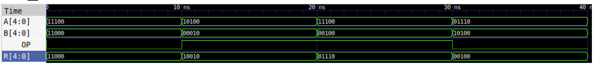
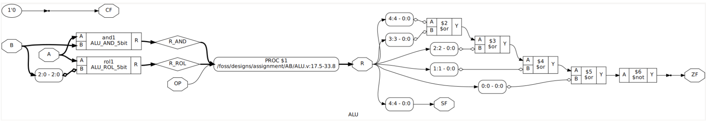
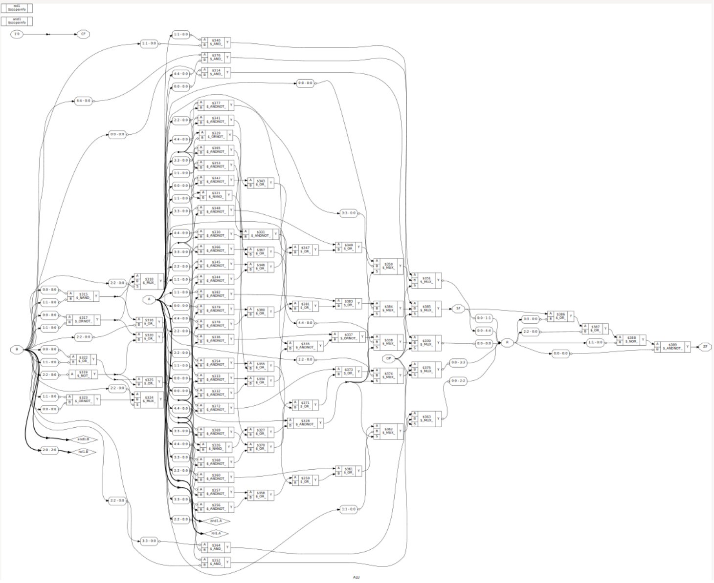
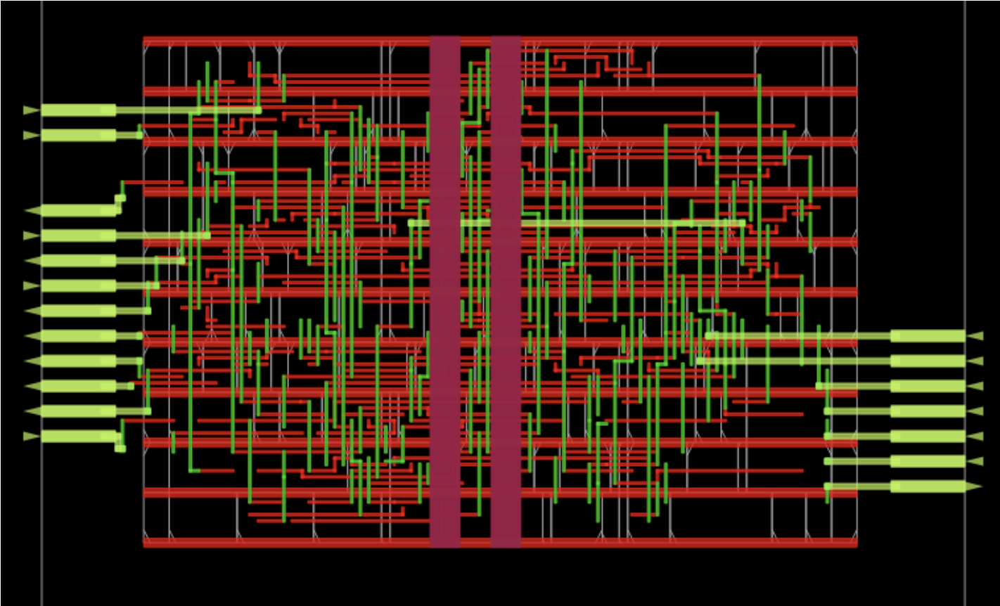

# 5‑bit ALU & FSM and Synthesis using 130nm Skywater PDK with OpenLane toolchain

A 5‑bit Arithmetic‑Logic Unit (ALU) together with a simple finite‑state‑machine (FSM) controller, packaged for simulation, synthesis and full physical implementation with the **OpenLane** Skywater‑130 nm open PDK flow. This project demonstrates the complete RTL‑to‑GDSII path for both a standalone combinational ALU and a larger SoC‑style block where an FSM drives the ALU datapath and outputs a *flag* indicating whether the result is non‑zero.

---

## Project Highlights

* **Word size :** 5 bits
* **ALU operations :**

  * `AND` (logical)
  * `ROL` (rotate‑left with programmable amount)
* **Controller :** 5‑state Mealy FSM (START → ONE → TWO → THREE → FINISH) that repeatedly feeds test vectors to the ALU.
* **Flow :** RTL simulation with *Icarus Verilog* → Synthesis using **OpenLane** (Sky130)
* **Collateral :** automated testbenches, waveform dumps, hierarchical netlists, floorplans, GDS, power reports and heat‑maps.

---

## Repository Layout

```
|
├── ALU                        # Stand‑alone combinational core
│   ├── ALU.v                  # Top RTL
│   ├── ALU_AND_5bit.v         # AND datapath slice
│   ├── ALU_ROL_5bit.v         # Rotate‑left datapath slice
│   ├── ALU_tb.v               # Self‑checking testbench
│   └── config.json            # OpenLane run‑set
└── FSM                        # Full system with controller
    ├── ALU.v
    ├── ALU_AND_5bit.v
    ├──ALU_ROL_5bit.v
    ├── ALU_tb.v
    ├── Controller.v           # 5‑state controller
    ├── Controller_tb.v        # Controller testbench
    ├── top.v                  # wrapper (controller + ALU)
    ├── top_tb.v               # Top‑level testbench
    └── config.json            # OpenLane run‑set
```


---

## Instructions

### 1  Install OpenLane, docker

### 2  Launch the OpenLane using Docker

```bash
docker load -i /home/user/Desktop/openlane.tar

docker run -it -e DISPLAY=$DISPLAY \
    -v /tmp/.X11-unix:/tmp/.X11-unix --user $(id -u):$(id -g) \
    --device /dev/dri openlane:latest #openlane:latest
```

This drops you into `/openlane`.  All further commands assume the repository is mounted at `/designs` inside the container.

---

## Simulation Workflow

> The examples below target the ALU core; substitute `FSM` and `top_tb.v` for the controller‑based system.

```bash
# ➊  Move into the design directory
cd /designs/ALU

# ➋  Compile the RTL & testbench
iverilog -o alu.vvp ALU_tb.v ALU.v ALU_AND_5bit.v ALU_ROL_5bit.v

# ➌  Run the simulation and open waveforms
vvp alu.vvp
gtkwave alu_test.vcd
```

---

## Synthesis & Physical Implementation

```bash
# From inside the design/ALU directory
openlane config.json            
```

OpenLane executes the full ASIC flow (synthesis → floorplan → STA → routing → DRC → GDS).  Results are placed in a time‑stamped `runs/` folder, e.g. `runs/RUN_2025-06-03_14-42-08/`.

### Key Artefacts (per run)

| Stage                    | Location                                       | How to view                    |
| ------------------------ | ---------------------------------------------- | ------------------------------ |
| **RTL synthesis report** | `06-yosys-synthesis/reports/stat.rpt`          | `gedit stat.rpt`               |
| **Netlist graphs**       | `06-yosys-synthesis/hierarchy.dot`             | `xdot hierarchy.dot`           |
| **Floorplan log**        | `13-openroad-floorplan/openroad-floorplan.log` | `gedit openroad-floorplan.log` |
| **Power report**         | `54-openroad-sta/nom_tt_025C_1v80/power.rpt`   | `gedit power.rpt`              |
| **Final GDS**            | `final/gds/ALU.gds`                            | `klayout ALU.gds`              |
| **Heat‑map (ODB)**       | `final/odb/ALU.odb`                            | `openroad -gui`                |


---

## Full Command Reference

Below is a verbatim recipe for reproducing every step, adapted for both designs.

```bash
# ---------- 1. Create and enter design folder ----------
mkdir ALU && cd ALU                     # or mkdir FSM && cd FSM

# ---------- 2. Create/Copy RTL sources ----------
gedit ALU.v ALU_tb.v ALU_AND_5bit.v ALU_ROL_5bit.v #Copy and paste the corresponding codes
# (FSM only) gedit top.v top_tb.v Controller.v Controller_tb.v
#            gedit config.json

# ---------- 3. Compile & simulate ----------
iverilog -o alu.vvp ALU_tb.v ALU.v ALU_AND_5bit.v ALU_ROL_5bit.v
vvp alu.vvp
gtkwave alu_test.vcd

# ---------- 4. Run OpenLane flow ----------
openlane config.json

#   Synthesis summary / cell usage
cd /runs
cd "$latest/06-yosys-synthesis/reports" && gedit stat.rpt   # $latest$ -> latest directory e.g, runs/RUN_2025-06-03_14-42-08/...

#   Hierarchical netlist graphs
cd "$latest/06-yosys-synthesis" && xdot hierarchy.dot && xdot primitive_techmap.dot &

#   Floorplan, power, GDS, heat‑map
cd "$latest/13-openroad-floorplan" && gedit openroad-floorplan.log
cd "$latest/54-openroad-sta/nom_tt_025C_1v80" && gedit power.rpt
cd "$latest/final/gds" && klayout ALU.gds
cd "$latest/final/odb" && openroad -gui
```

---

## Example Figures

Below are a few representative screenshots that showcase the design at key points in the OpenLane flow:

### 1. **RTL Timing Diagram** – waveform of the ALU testbench
    
   
### 2. **Synthesised Hierarchy Graph** – generated by Yosys (`hierarchy.dot`).
   

### 3. **Synthesised Primitive Heatmap Graph** – generated by Yosys (`primitive_heatmap.dot`).
    

### 4. **Synthesised Primitive Heatmap Graph** – generated by Yosys (`primitive_heatmap.dot`).
    

### 5. **GDS Layout** – final chip layout opened in KLayout (`ALU.gds`).
   

### 6. **Placement / Routing Heat‑map** – congestion & density view from OpenROAD GUI (`ALU.odb`).
   

